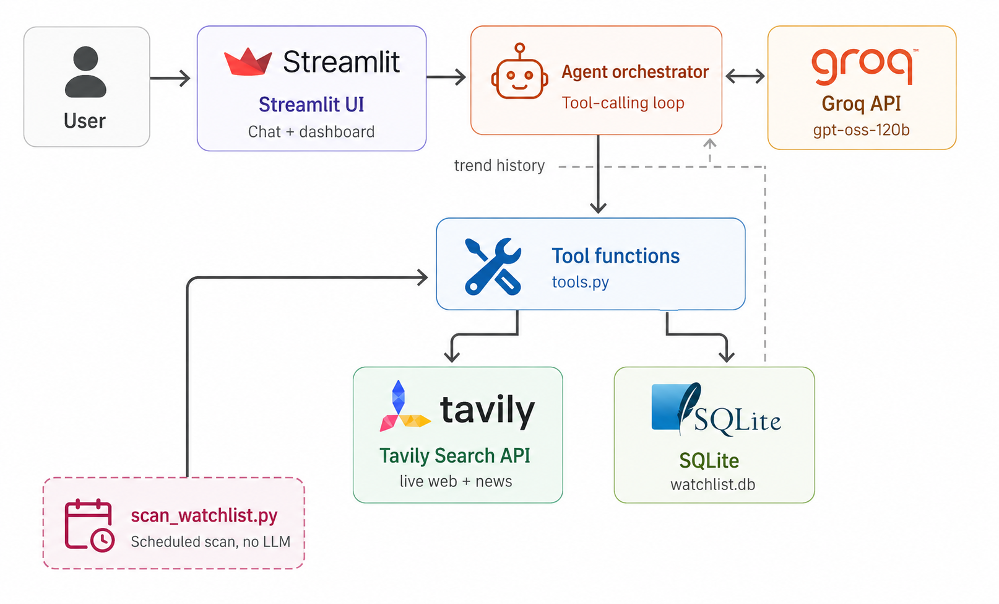

# 📈 Market Trend Research Agent

An agentic AI research assistant that monitors what's trending in a market, product, or brand — using **real, live web data** (not hardcoded fixtures), real sentiment scoring, and a persistent watchlist that builds an actual trend-over-time history.


## Why this exists

Automated market/competitive intelligence is a real, well-established B2B category — tools like **Klue**, **Crayon**, and **Contify** sell exactly this (automated trend + competitor monitoring) to marketing and product teams, typically for **$15k–$40k/year per enterprise contract**. This project is a lightweight version of that same idea: point it at a topic, brand, or competitor, and it researches, scores, and tracks it — grounded in real search results, not the LLM's memory.

## What it does

- **Research on demand** — ask "what's trending in X" and the agent runs real web + news searches, scores real sentiment on the results, and reports a confidence level based on how many independent sources back the finding
- **Competitor comparison** — ask it to compare two brands/products side by side
- **Persistent watchlist** — save topics for ongoing monitoring; each scan is stored with a timestamp, building a real time series
- **Trend charts** — the dashboard tab plots sentiment over time from actual stored scan history
- **Real scheduling path** — `scan_watchlist.py` is a standalone script (no LLM involved) that a real cron job or GitHub Actions workflow can call automatically, separate from the chat UI

## Demo

This isn't deployed to a public URL — it runs on personal API keys with usage-based cost, so a public link would mean strangers spending your credits. Instead, every API key used here has a genuine free tier (Groq and Tavily both, no card required), so anyone reviewing this can run it end-to-end in a few minutes with their own keys — see [Running it locally](#running-it-locally) below.

---

## Architecture



**Flow in plain English:** the user talks to the **Streamlit** app, which branches out to two services — **Tavily** for real web/news search, and **Groq** for the LLM (running `openai/gpt-oss-120b` with tool calling). Under the hood this branching is the tool-calling loop in `agent.py`: Streamlit hands the conversation to Groq, Groq decides whether to call a tool, and if so Python executes the real function (a live Tavily search, a VADER sentiment score, or a SQLite read/write) before the result goes back to Groq for a grounded final answer.

A third piece not pictured above: `scan_watchlist.py` is a standalone script that calls the same tool functions directly, on a real schedule (cron / GitHub Actions), without going through Groq at all — since a scheduled scan is just search → score → store, there's no reason to spend an LLM call triggering it.

Separately, the **watchlist scan** doesn't need an LLM at all — it's a deterministic pipeline (search → score → store), so `scan_watchlist.py` can run on a real schedule independent of the chat interface, which is how you'd actually operationalize "check this every morning" in production.

---

## Design principle: confidence over confident-sounding guesses

Every trend report includes an explicit `confidence` field (`high` / `medium` / `low` / `none`), computed from how many **independent sources** (unique domains) back the finding — not just how many search results came back. The system prompt (`agent.py`) requires the model to surface this to the user rather than stating a thin, single-source signal as a confirmed trend.

This matters more here than in a typical Q&A bot: a fabricated *bill amount* is bad, but a fabricated *market trend* is the kind of thing that could actually influence a business decision if the agent overstates its confidence. Naming and designing against that is the core engineering decision in this project, not an afterthought.

---

## Tools / Functions

| Tool | Purpose | Real data source |
|---|---|---|
| `search_web(query)` | Quick one-off factual lookup | Tavily search API |
| `build_trend_report(topic)` | Full research pass: general + news search, sentiment scoring, source-diversity confidence | Tavily + VADER sentiment |
| `compare_topics(a, b)` | Two trend reports side by side (e.g. competitor comparison) | Tavily + VADER sentiment |
| `add_to_watchlist(topic)` | Start monitoring a topic | SQLite |
| `remove_from_watchlist(topic)` | Stop monitoring a topic | SQLite |
| `list_watchlist()` | See all monitored topics + latest snapshot | SQLite |
| `get_watchlist_history(topic)` | Full historical snapshot series for charting | SQLite |
| `run_watchlist_scan()` | Re-check every watchlisted topic now, storing a new dated snapshot | Tavily + VADER + SQLite |

---

## Tech stack

- **LLM with tool calling:** [Groq API](https://console.groq.com/docs) running `openai/gpt-oss-120b` — OpenAI's open-weight model, hosted on Groq's fast inference hardware (hundreds of tokens/sec), OpenAI-compatible tool-calling format. **Groq's model lineup changes fairly often** (Llama chat models were retired from the production tier since this project was first scaffolded) — check [console.groq.com/docs/models](https://console.groq.com/docs/models) for the current list before assuming a model string still works
- **Real web search:** [Tavily](https://tavily.com) — a search API purpose-built for LLM agents; free tier gives 1,000 searches/month, no card required
- **Sentiment:** [VADER](https://github.com/cjhutto/vaderSentiment) — a local, offline lexicon-based sentiment model (no extra API calls or cost)
- **Persistence:** SQLite (`data/watchlist.db`) — real trend-over-time history, not session state
- **Orchestration:** plain Python (`agent.py`) — hand-rolled tool-calling loop, no framework
- **UI:** Streamlit, two tabs (chat + watchlist dashboard with Plotly charts)
- **Scheduling:** `scan_watchlist.py`, runnable via cron / GitHub Actions / Task Scheduler

---

## Project structure

```
trend-agent/
├── app.py                  # Streamlit UI (chat + watchlist dashboard)
├── agent.py                 # orchestration loop: Groq call + tool dispatch
├── tools.py                  # tool functions + schemas (search, sentiment, watchlist)
├── scan_watchlist.py          # standalone scheduled-scan entry point (no LLM)
├── data/
│   └── watchlist.db            # created automatically on first run
├── requirements.txt
└── README.md
```

---

## Running it locally

### 1. Get free API keys
- **Groq:** [console.groq.com/keys](https://console.groq.com/keys) — free, no card required for the trial tier
- **Tavily:** [tavily.com](https://tavily.com) — free tier, 1,000 searches/month, no card required

### 2. Install dependencies
```bash
git clone <your-repo-url>
cd trend-agent
pip install -r requirements.txt
```

### 3. Set your API keys

**Recommended: `.env` file (works the same on every OS, no retyping each session)**

Copy the template and fill in your real keys:
```bash
cp .env.example .env
```
Then open `.env` in any text editor and replace the placeholders:
```
GROQ_API_KEY=gsk_your_real_key_here
TAVILY_API_KEY=tvly_your_real_key_here
```
`.env` is already in `.gitignore` — it will never be committed or shared, and `tools.py` / `agent.py` load it automatically on startup via `python-dotenv`.

**Alternative: set env vars manually (if you'd rather not use a file)**

macOS / Linux (bash/zsh):
```bash
export GROQ_API_KEY="gsk_..."
export TAVILY_API_KEY="tvly-..."
```

Windows PowerShell (current session only):
```powershell
$env:GROQ_API_KEY = "gsk_..."
$env:TAVILY_API_KEY = "tvly-..."
```

Windows PowerShell (persistent — requires closing and reopening the terminal):
```powershell
setx GROQ_API_KEY "gsk_..."
setx TAVILY_API_KEY "tvly-..."
```

### 4. Run it
```bash
streamlit run app.py
```

---

## Deploying to Streamlit Community Cloud

1. Push this repo to GitHub.
2. Go to [share.streamlit.io](https://share.streamlit.io), connect the repo, `app.py` as the entry point.
3. In **Settings → Secrets**, add:
   ```toml
   GROQ_API_KEY = "gsk_..."
   TAVILY_API_KEY = "tvly-..."
   ```
4. Deploy — you'll get a public URL.

**Note:** Streamlit Community Cloud's filesystem resets on redeploy, so `watchlist.db` won't persist long-term there. For a real deployment you'd point `DB_PATH` at a hosted database (e.g. a small Postgres instance) instead of local SQLite — worth mentioning as a known limitation if this comes up in an interview.

## Setting up real scheduled scans (optional)

`scan_watchlist.py` runs independently of the chat UI. Example GitHub Actions workflow (`.github/workflows/scan.yml`):

```yaml
on:
  schedule:
    - cron: '0 8 * * *'   # every day at 8am UTC
jobs:
  scan:
    runs-on: ubuntu-latest
    steps:
      - uses: actions/checkout@v4
      - uses: actions/setup-python@v5
        with: {python-version: '3.11'}
      - run: pip install -r requirements.txt
      - run: python scan_watchlist.py
        env:
          TAVILY_API_KEY: ${{ secrets.TAVILY_API_KEY }}
```

---

## Test cases to run before calling it done

- *"What's trending in electric bikes right now?"* → should call `build_trend_report`, cite real sources, state a confidence level
- *"Compare sentiment on Tesla vs Rivian"* → should call `compare_topics`
- *"Add 'AI coding assistants' to my watchlist"* → should call `add_to_watchlist`, confirm
- *"What's the latest on the CHIPS Act?"* → should call `search_web` (quick lookup, not a full trend report)
- *"Refresh my watchlist now"* → should call `run_watchlist_scan`
- A topic with very few/low-quality results → should report `confidence: low` and hedge explicitly, not state a confirmed trend
- *"What's your favorite movie?"* → should decline gracefully, stay in scope

---

## Limitations & what a production version would add

- **Rate limits:** Tavily's free tier caps at 1,000 searches/month; each `build_trend_report` call uses 2 (general + news), and a full watchlist scan multiplies that by the number of topics — fine for a demo, would need a paid tier for real production volume.
- **Source depth:** search snippets only, not full page scraping — a production version might add a content-extraction step (e.g. Tavily's "advanced" search depth, or Firecrawl) for deeper analysis.
- **Sentiment granularity:** VADER is fast and free but lexicon-based, not deep learning — a production version might swap in a fine-tuned classifier or use the LLM itself for nuanced sentiment on ambiguous text.
- **Scheduling & storage:** local SQLite + manual cron works for a demo; production would use a hosted database and a real job scheduler (Airflow, GitHub Actions, or a cloud scheduler) with monitoring/alerting on failures.
- **No authentication or multi-tenancy** — this is a single-user demo. A real product would need accounts, so each user/team has their own watchlist.

## Stretch goals (not implemented)

- Slack/email alerts when a watchlisted topic's sentiment or volume moves sharply
- Full-text content extraction instead of snippet-only analysis
- Export a trend report as a shareable PDF/deck
